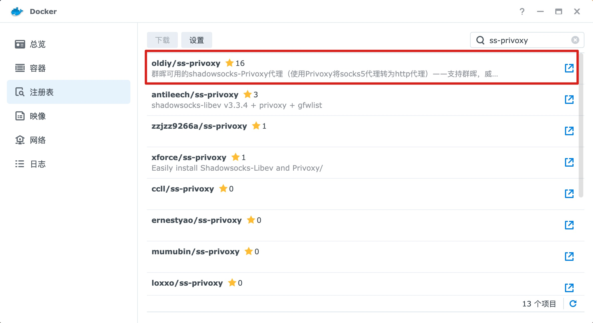
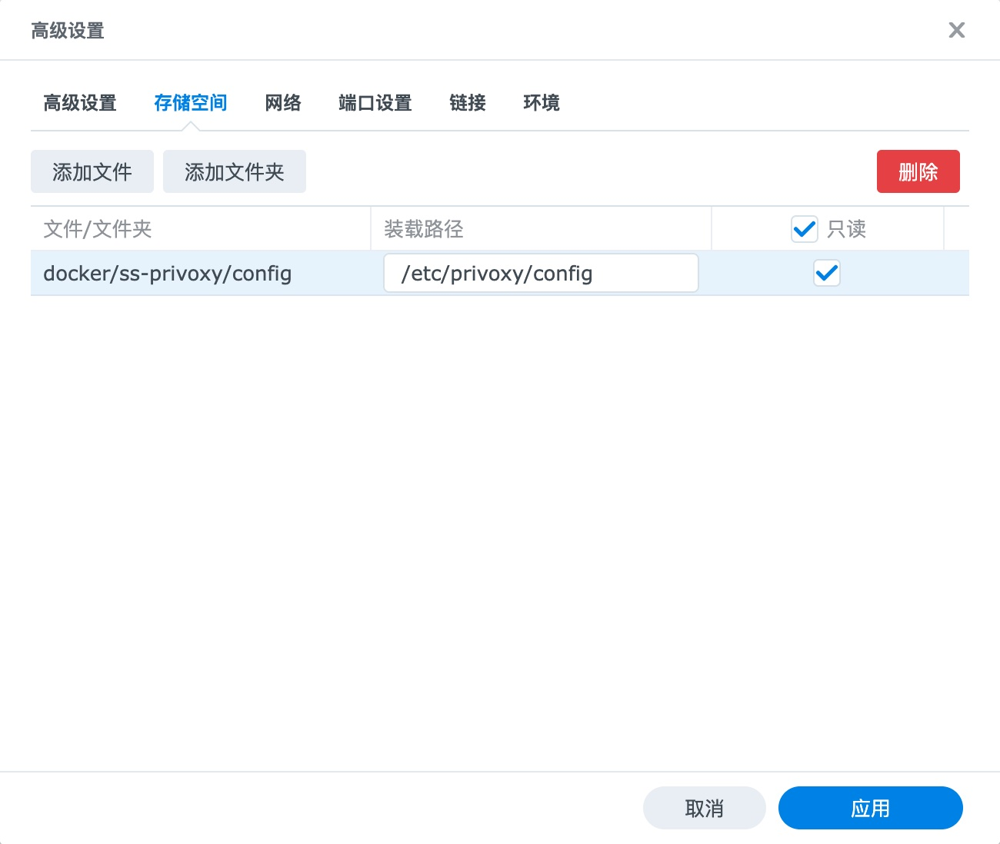
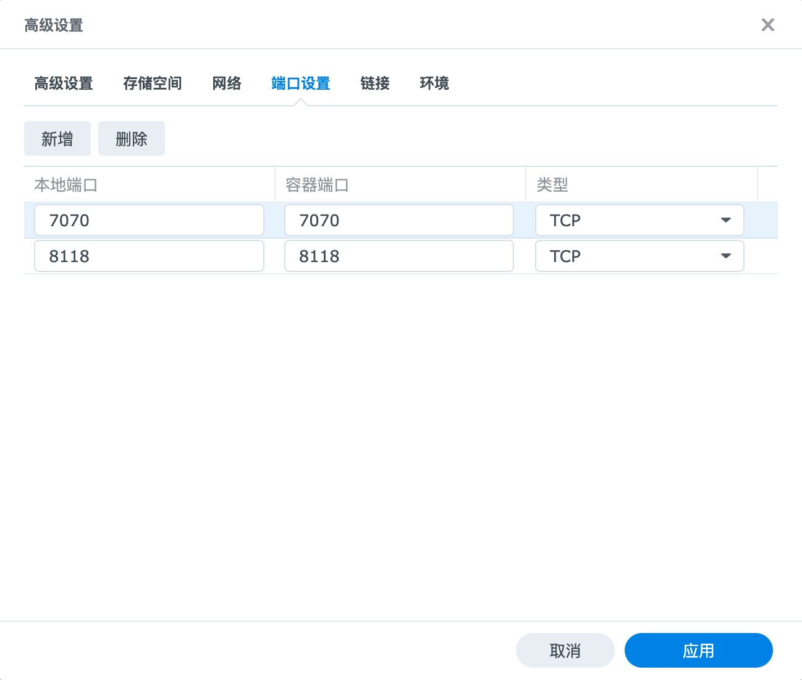
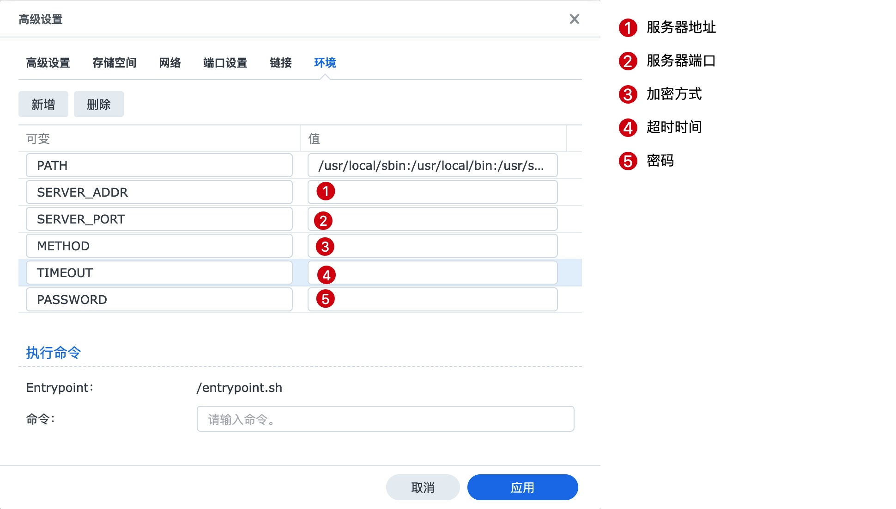
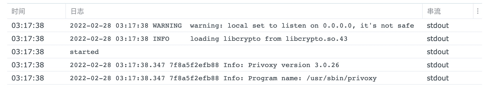
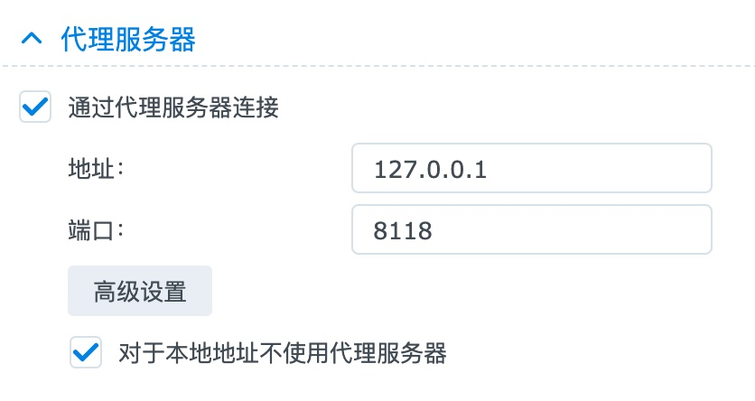

# 群辉 shadowsocks 配置

先说说为啥我有这样的需求哈，主要会在群辉终端中拉取一些资源，不过由于墙的原因，经常超时失败。我之前自己买了国外的 VPS 搭建了一个机场，平时科学上网也在用，就想这群辉上能不能也整一个客户端。也去搜了群辉科学上网的一些例子，有软路由还有旁路由啥的，感觉好麻烦啊，而且我对性能和速度也没特别大的要求，毕竟用的时候也不多，所以怎么简单怎么来，最好 docker 即装即用。

确实也找到了一个可用的方案，也确实比较适合我，如果有相同需求的小伙伴可以试试。

首先群辉 docker 注册表中搜索 ss-privoxy 找到第一个`oldiy/ss-privoxy`镜像下载下来



在启动之前，需要创建一份配置文件，新建文件`config`（没有拓展名），输入以下内容：

```
confdir /etc/privoxy
logdir /var/log/privoxy
actionsfile match-all.action
actionsfile default.action
actionsfile user.action
filterfile default.filter
filterfile user.filter
logfile privoxy.log
listen-address :8118
toggle 1
enable-remote-toggle 0
enable-remote-http-toggle 0
enable-edit-actions 0
enforce-blocks 0
buffer-limit 4096
enable-proxy-authentication-forwarding 0

# 全局代理
forward-socks5 / 127.0.0.1:7070 .

# 配置特定路由代理
# forward / .
# forward-socks5 .*google*.* 127.0.0.1:7070 .

forwarded-connect-retries 0
accept-intercepted-requests 0
allow-cgi-request-crunching 0
split-large-forms 0
keep-alive-timeout 300
tolerate-pipelining 1
default-server-timeout 60
socket-timeout 300
```

默认全局代理，你可以将注释配置启用特定路由代理，例如仅代理 google 相关接口

```
# 全局代理
# forward-socks5 / 127.0.0.1:7070 .

# 配置特定路由代理
forward / .
forward-socks5 .*google*.* 127.0.0.1:7070 .
```

在文件夹`docker`中创建`ss-privoxy`文件夹，并上传配置`config`。

之后启动，进入`高级设置`，切换到`存储空间`点击`添加文件`，挂载上传的配置文件，设置为`只读`



然后进入`端口`设置



最后在`环境`变量指定



最后启动，查看日志，输入一下信息就代表成功了



群辉 DSM 想使用代理只需要到`网络`中启用`代理服务器`，这里的端口必须和之前映射的端口一致



`Antivirus Essential`就可以正常更新病毒库了，否则怎么更新都会失败

代理想要在终端中使用仅仅只需要执行一行命令

```
export http_proxy=http://127.0.0.1:8118;export https_proxy=http://127.0.0.1:8118;
```

但是每次退出都会失效，可以写一个脚本，每次`source`一下就好了，甚至直接添加到`.profile`中（不过我没这样做，VPN 只有用到的时候我才打开）

```
echo "export http_proxy=http://127.0.0.1:8118;export https_proxy=http://127.0.0.1:8118;" > setup-proxy
source setup-proxy
```

这样安装`opkg` `git` `zsh` `ohmyzsh` `pip`都不是啥问题了

你问问这样折腾干嘛？因为 ~~给大姐姐刮削封面~~ 热爱折腾。